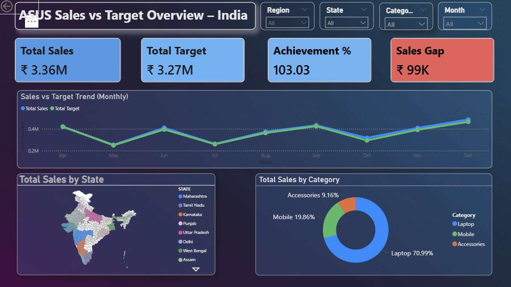
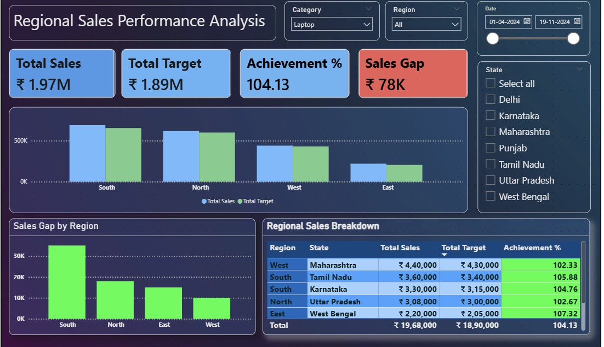
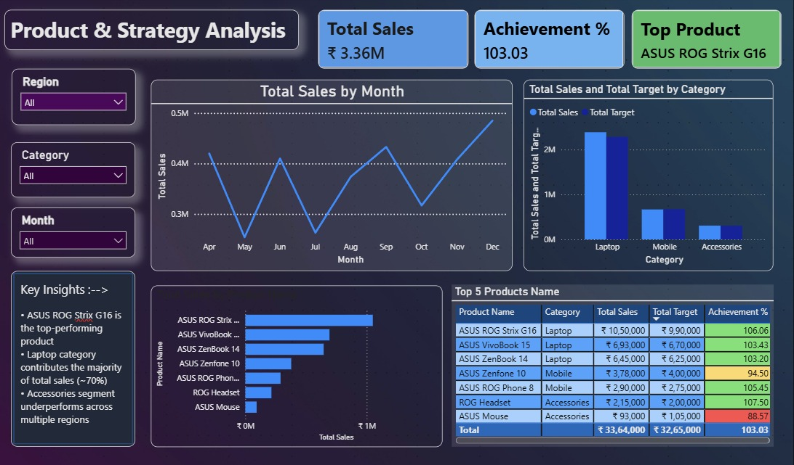

# ASUS Sales Dashboard (Power BI)

## 📊 Overview
This project is a Power BI dashboard analyzing ASUS sales performance across regions, products, and categories.

## 📌 Key Features
- Sales vs Target analysis
- Regional performance insights
- Product-wise analysis
- Top-performing products identification

## 📈 Dashboard Pages
1. Overview Dashboard
2. Regional Performance Analysis
3. Product & Strategy Analysis

## 💡 Key Insights
- Laptop category contributes majority of sales
- ASUS ROG Strix G16 is the top-performing product
- Accessories segment underperforms across regions

## 🛠 Tools Used
- Power BI
- DAX
- Excel / CSV

## 📷 Dashboard Preview

